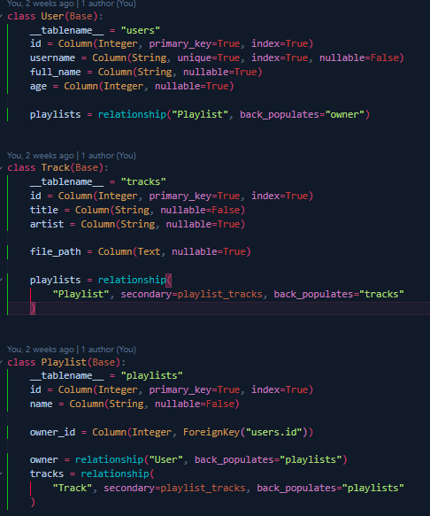

# 🎵 Streaming de Áudio Multiplataforma

## Visão Geral

Sistema completo de gerenciamento de músicas e playlists implementado com **Python** e **JavaScript**, utilizando **SQLite** como banco de dados. O projeto demonstra a implementação de múltiplos padrões arquiteturais modernos através de diferentes tecnologias de API.

### Arquitetura da Solução

- **Backend Python**: Responsável pela inicialização do banco de dados, modelos de dados e implementação dos serviços via FastAPI
- **Backend JavaScript**: Implementação de múltiplos protocolos de comunicação (REST, GraphQL, gRPC, SOAP) utilizando Express.js
- **Armazenamento**: SQLite com relacionamentos bem definidos entre entidades
- **Mídia**: Biblioteca de 10 arquivos MP3 armazenados localmente para streaming sob demanda

A abordagem permite comparar diferentes paradigmas de comunicação cliente-servidor no mesmo contexto de domínio.

## MODELS

Abaixo temos um exemplo dos models e também explicando brevemente como funciona a relação deles



A tabela User possui uma relação de um-para-muitos com Playlist, pois cada usuário pode ter várias playlists, e isso é definido pela chave estrangeira owner_id presente em Playlist, além do relationship que liga User.playlists a Playlist.owner. Já as tabelas Playlist e Track possuem uma relação de muitos-para-muitos, porque uma playlist pode conter várias músicas e ao mesmo tempo uma música pode estar presente em várias playlists. Essa relação é construída usando a tabela associativa playlist_tracks, que aparece como secondary no relationship de ambos os lados. Assim, o modelo representa: um usuário possui várias playlists, e cada playlist é formada por várias músicas que podem também aparecer em outras playlists.

## Endpoints Implementados

Todos os protocolos de comunicação (REST, GraphQL, gRPC, SOAP) implementam os seguintes 6 operações principais:

| Operação | Descrição | Parâmetro |
|----------|-----------|-----------|
| **List Users** | Retorna todos os usuários registrados no banco de dados | - |
| **List Tracks** | Retorna todas as músicas disponíveis para streaming | - |
| **User Playlists** | Lista as playlists criadas por um usuário específico | `user_id` |
| **Playlist Tracks** | Retorna todas as músicas presentes em uma playlist | `playlist_id` |
| **Track Playlists** | Mostra todas as playlists que contêm uma determinada música | `track_id` |
| **Track Details** | Fornece informações detalhadas de uma música específica | `track_id` |

### Streaming de Áudio

A implementação em **REST** oferece suporte nativo a streaming de áudio com suporte a requisições parciais (HTTP Range), permitindo reprodução progressiva dos arquivos MP3 com pause/resume.

## REST

### Descrição

REST (Representational State Transfer) utiliza verbos HTTP e URIs para operações em recursos. Implementada em Express.js com suporte completo a **HTTP Range Requests** para streaming progressivo de áudio.

**Características principais:**
- Endpoints estateless baseados em recursos
- Suporte a requisições parciais (HTTP 206 Partial Content)
- Permite pause/resume em streaming de áudio
- Respostas em JSON estruturado

### JavaScript

```
// ================================================
//   REST
// ================================================
const restRouter = express.Router();

restRouter.get("/users", async (_, res) => {
  res.json(await User.findAll());
});

restRouter.get("/tracks", async (_, res) => {
  res.json(await Track.findAll());
});

restRouter.get("/playlists/:id/tracks", async (req, res) => {
  try {
    const { id } = req.params;

    const playlist = await Playlist.findByPk(id);

    if (!playlist) {
      return res.status(404).json({ error: "Playlist não encontrada" });
    }

    const tracks = await playlist.getTracks({
      attributes: ["id", "title", "artist", "file_path"],
    });

    return res.json(tracks);
  } catch (err) {
    console.error(err);
    return res
      .status(500)
      .json({ error: "Erro ao buscar músicas da playlist" });
  }
});

restRouter.get("/tracks/:track_id/playlists", async (req, res) => {
  try {
    const { track_id } = req.params;

    const track = await Track.findByPk(track_id);
    if (!track) {
      return res.status(404).json({ error: "Música não encontrada" });
    }

    const playlists = await track.getPlaylists({
      attributes: ["id", "name", "owner_id"],
    });

    return res.json(playlists);
  } catch (err) {
    console.error(err);
    res.status(500).json({ error: "Erro ao buscar playlists da música" });
  }
});

// ================================================
//   STREAM DE ÁUDIO
// ================================================
restRouter.get("/stream/:track_id", async (req, res) => {
  const { track_id } = req.params;

  try {
    const track = await Track.findByPk(track_id);

    if (!track) {
      return res.status(404).json({ error: "Música não encontrada" });
    }

    if (!track.file_path) {
      return res.status(404).json({ error: "Arquivo de áudio não disponível" });
    }

    const mediaPath = track.file_path;

    if (!fs.existsSync(mediaPath)) {
      return res.status(404).json({ error: "Arquivo não encontrado" });
    }

    const fileSize = fs.statSync(mediaPath).size;
    const range = req.headers.range;

    let start = 0;
    let end = fileSize - 1;

    if (range) {
      const [rStart, rEnd] = range.replace(/bytes=/, "").split("-");
      start = parseInt(rStart, 10);
      end = rEnd ? parseInt(rEnd, 10) : fileSize - 1;

      if (start >= fileSize) {
        return res.status(416).send("Requested range not satisfiable");
      }
    }

    const chunkSize = end - start + 1;
    const file = fs.createReadStream(mediaPath, { start, end });

    res.writeHead(range ? 206 : 200, {
      "Content-Range": `bytes ${start}-${end}/${fileSize}`,
      "Accept-Ranges": "bytes",
      "Content-Length": chunkSize,
      "Content-Type": "audio/mpeg",
    });

    file.pipe(res);
  } catch (err) {
    console.error(err);
    res.status(500).json({ error: "Erro interno" });
  }
});
```

### Python

```
@router.get("/users", response_model=List[UserOut])
def list_users(db: Session = Depends(get_db)):
    """
    List of all users.
    """
    return db.query(User).all()


@router.get("/tracks", response_model=List[TrackOut])
def list_tracks(db: Session = Depends(get_db)):
    """
    List all the tracks available in db.
    """
    return db.query(Track).all()


@router.get("/users/{user_id}/playlists", response_model=List[PlaylistOut])
def playlists_of_user(user_id: int, db: Session = Depends(get_db)):
    """
    List all the playlists of a specific user.
    """
    user = db.query(User).filter(User.id == user_id).first()
    if not user:
        raise HTTPException(status_code=404, detail="Usuário não encontrado")
    return user.playlists


@router.get("/playlists/{playlist_id}/tracks", response_model=List[TrackOut])
def tracks_of_playlist(playlist_id: int, db: Session = Depends(get_db)):
    """
    List all the musics(tracks) in a playlist.
    """
    playlist = db.query(Playlist).filter(Playlist.id == playlist_id).first()
    if not playlist:
        raise HTTPException(status_code=404, detail="Playlist não encontrada")
    return playlist.tracks


@router.get("/tracks/{track_id}/playlists", response_model=List[PlaylistOut])
def playlists_containing_track(track_id: int, db: Session = Depends(get_db)):
    """
    Return all the playlists that contain a specific track.
    """
    track = db.query(Track).filter(Track.id == track_id).first()
    if not track:
        raise HTTPException(status_code=404, detail="Música não encontrada")
    return track.playlists


@router.get("/stream/{track_id}")
async def stream_track(track_id: int, request: Request, db: Session = Depends(get_db)):
    """
    Return the music by it's id.
    """
    track = db.query(Track).filter(Track.id == track_id).first()

    if not track:
        raise HTTPException(status_code=404, detail="Música não encontrada")

    if not track.file_path:
        raise HTTPException(status_code=404, detail="Arquivo de áudio não disponível")

    path = Path(track.file_path)
    if not path.exists():
        raise HTTPException(status_code=404, detail="Arquivo não encontrado")

    file_size = path.stat().st_size
    range_header = request.headers.get("range")

    if range_header:
        # Ex: bytes=1000-5000
        byte1, byte2 = range_header.replace("bytes=", "").split("-")
        start = int(byte1)
        end = int(byte2) if byte2 else file_size - 1
    else:
        start = 0
        end = file_size - 1

    def iterfile():
        with open(path, "rb") as f:
            f.seek(start)
            remaining = end - start + 1
            chunk_size = 1024 * 1024  # 1 MB
            while remaining > 0:
                chunk = f.read(min(chunk_size, remaining))
                if not chunk:
                    break
                remaining -= len(chunk)
                yield chunk

    headers = {
        "Content-Range": f"bytes {start}-{end}/{file_size}",
        "Accept-Ranges": "bytes",
        "Content-Length": str(end - start + 1),
        "Content-Type": "audio/mpeg",
    }

    return StreamingResponse(iterfile(), status_code=206, headers=headers)

```

## SOAP

### Descrição

SOAP (Simple Object Access Protocol) é um protocolo baseado em XML que permite comunicação entre aplicações de forma mais estruturada e formal. Utiliza conceitos de RPC (Remote Procedure Call) com suporte a serviços complexos e integração corporativa.

**Características principais:**
- Comunicação estruturada via XML
- Suporte a tipos complexos e arrays
- WSDL (Web Services Description Language) para definição de serviços
- Segurança e confiabilidade em comunicações
- Adequado para integrações em ambientes corporativos

### JavaScript

```
const wsdl = `<definitions name="MusicService"
  targetNamespace="http://example.com/music"
  xmlns="http://schemas.xmlsoap.org/wsdl/"
  xmlns:tns="http://example.com/music"
  xmlns:soap="http://schemas.xmlsoap.org/wsdl/soap/"
  xmlns:xsd="http://www.w3.org/2001/XMLSchema">

  <!-- TYPES (vazio, permitido em RPC) -->
  <types>
    <xsd:schema targetNamespace="http://example.com/music"/>
  </types>

  <!-- MESSAGES -->
  <message name="getUsersRequest"/>
  <message name="getUsersResponse">
    <part name="users" type="xsd:string"/>
  </message>

  <message name="getTracksRequest"/>
  <message name="getTracksResponse">
    <part name="tracks" type="xsd:string"/>
  </message>

  <message name="playlistsOfUserRequest">
    <part name="user_id" type="xsd:int"/>
  </message>
  <message name="playlistsOfUserResponse">
    <part name="playlists" type="xsd:string"/>
  </message>

  <message name="tracksOfPlaylistRequest">
    <part name="playlist_id" type="xsd:int"/>
  </message>
  <message name="tracksOfPlaylistResponse">
    <part name="tracks" type="xsd:string"/>
  </message>

  <message name="playlistsContainingTrackRequest">
    <part name="track_id" type="xsd:int"/>
  </message>
  <message name="playlistsContainingTrackResponse">
    <part name="playlists" type="xsd:string"/>
  </message>

  <message name="trackInfoRequest">
    <part name="track_id" type="xsd:int"/>
  </message>
  <message name="trackInfoResponse">
    <part name="track" type="xsd:string"/>
  </message>

  <!-- PORT TYPE -->
  <portType name="MusicPortType">

    <operation name="getUsers">
      <input message="tns:getUsersRequest"/>
      <output message="tns:getUsersResponse"/>
    </operation>

    <operation name="getTracks">
      <input message="tns:getTracksRequest"/>
      <output message="tns:getTracksResponse"/>
    </operation>

    <operation name="playlistsOfUser">
      <input message="tns:playlistsOfUserRequest"/>
      <output message="tns:playlistsOfUserResponse"/>
    </operation>

    <operation name="tracksOfPlaylist">
      <input message="tns:tracksOfPlaylistRequest"/>
      <output message="tns:tracksOfPlaylistResponse"/>
    </operation>

    <operation name="playlistsContainingTrack">
      <input message="tns:playlistsContainingTrackRequest"/>
      <output message="tns:playlistsContainingTrackResponse"/>
    </operation>

    <operation name="trackInfo">
      <input message="tns:trackInfoRequest"/>
      <output message="tns:trackInfoResponse"/>
    </operation>

  </portType>

  <!-- BINDING -->
  <binding name="MusicBinding" type="tns:MusicPortType">
    <soap:binding style="rpc" transport="http://schemas.xmlsoap.org/soap/http"/>

    <operation name="getUsers">
      <soap:operation soapAction="getUsers"/>
      <input>
        <soap:body use="encoded" namespace="http://example.com/music"
                   encodingStyle="http://schemas.xmlsoap.org/soap/encoding/"/>
      </input>
      <output>
        <soap:body use="encoded" namespace="http://example.com/music"
                   encodingStyle="http://schemas.xmlsoap.org/soap/encoding/"/>
      </output>
    </operation>

    <operation name="getTracks">
      <soap:operation soapAction="getTracks"/>
      <input>
        <soap:body use="encoded" namespace="http://example.com/music"
                   encodingStyle="http://schemas.xmlsoap.org/soap/encoding/"/>
      </input>
      <output>
        <soap:body use="encoded" namespace="http://example.com/music"
                   encodingStyle="http://schemas.xmlsoap.org/soap/encoding/"/>
      </output>
    </operation>

    <operation name="playlistsOfUser">
      <soap:operation soapAction="playlistsOfUser"/>
      <input>
        <soap:body use="encoded" namespace="http://example.com/music"
                   encodingStyle="http://schemas.xmlsoap.org/soap/encoding/"/>
      </input>
      <output>
        <soap:body use="encoded" namespace="http://example.com/music"
                   encodingStyle="http://schemas.xmlsoap.org/soap/encoding/"/>
      </output>
    </operation>

    <operation name="tracksOfPlaylist">
      <soap:operation soapAction="tracksOfPlaylist"/>
      <input>
        <soap:body use="encoded" namespace="http://example.com/music"
                   encodingStyle="http://schemas.xmlsoap.org/soap/encoding/"/>
      </input>
      <output>
        <soap:body use="encoded" namespace="http://example.com/music"
                   encodingStyle="http://schemas.xmlsoap.org/soap/encoding/"/>
      </output>
    </operation>

    <operation name="playlistsContainingTrack">
      <soap:operation soapAction="playlistsContainingTrack"/>
      <input>
        <soap:body use="encoded" namespace="http://example.com/music"
                   encodingStyle="http://schemas.xmlsoap.org/soap/encoding/"/>
      </input>
      <output>
        <soap:body use="encoded" namespace="http://example.com/music"
                   encodingStyle="http://schemas.xmlsoap.org/soap/encoding/"/>
      </output>
    </operation>

    <operation name="trackInfo">
      <soap:operation soapAction="trackInfo"/>
      <input>
        <soap:body use="encoded" namespace="http://example.com/music"
                   encodingStyle="http://schemas.xmlsoap.org/soap/encoding/"/>
      </input>
      <output>
        <soap:body use="encoded" namespace="http://example.com/music"
                   encodingStyle="http://schemas.xmlsoap.org/soap/encoding/"/>
      </output>
    </operation>

  </binding>

  <!-- SERVICE -->
  <service name="MusicService">
    <port name="MusicPort" binding="tns:MusicBinding">
      <soap:address location="http://localhost:3000/soap"/>
    </port>
  </service>

</definitions>
```

### Python

```

# ============================
#   MODELOS DE RESPOSTA SOAP
# ============================

class UserInfo(ComplexModel):
    id = Integer
    username = Unicode
    full_name = Unicode


class TrackInfo(ComplexModel):
    id = Integer
    title = Unicode


class PlaylistInfo(ComplexModel):
    id = Integer
    name = Unicode


# ============================
#         SERVIÇO SOAP
# ============================
class MusicSoapService(ServiceBase):

    @rpc(_returns=Array(UserInfo))
    def getUsers(ctx):
        db = SessionLocal()
        users = db.query(User).all()
        return [UserInfo(id=u.id, username=u.username, full_name=u.full_name) for u in users]

    @rpc(_returns=Array(TrackInfo))
    def getTracks(ctx):
        db = SessionLocal()
        tracks = db.query(Track).all()
        return [TrackInfo(id=t.id, title=t.title) for t in tracks]

    @rpc(Integer, _returns=Array(PlaylistInfo))
    def playlistsOfUser(ctx, user_id):
        db = SessionLocal()
        user = db.query(User).filter(User.id == user_id).first()
        if not user:
            return []
        return [PlaylistInfo(id=p.id, name=p.name) for p in user.playlists]

    @rpc(Integer, _returns=Array(TrackInfo))
    def tracksOfPlaylist(ctx, playlist_id):
        db = SessionLocal()
        playlist = db.query(Playlist).filter(Playlist.id == playlist_id).first()
        if not playlist:
            return []
        return [TrackInfo(id=t.id, title=t.title) for t in playlist.tracks]

    @rpc(Integer, _returns=Array(PlaylistInfo))
    def playlistsContainingTrack(ctx, track_id):
        db = SessionLocal()
        track = db.query(Track).filter(Track.id == track_id).first()
        if not track:
            return []
        return [PlaylistInfo(id=p.id, name=p.name) for p in track.playlists]

    @rpc(Integer, _returns=TrackInfo)
    def trackInfo(ctx, track_id):
        db = SessionLocal()
        track = db.query(Track).filter(Track.id == track_id).first()
        if not track:
            return TrackInfo(id=None, title="Not found", artist="", duration=0)
        return TrackInfo(id=track.id, title=track.title)


# ============================
#       APLICAÇÃO SOAP
# ============================

soap_app = Application(
    [MusicSoapService],
    tns="http://example.com/music",  # ⬅ mesmo que xmlns:mus
    in_protocol=Soap11(),
    out_protocol=Soap11(),
)

soap_service = WsgiApplication(soap_app)
```

## GraphQL

### Descrição

GraphQL é uma linguagem de query e manipulação de dados que oferece maior flexibilidade e eficiência comparado a REST. Permite que clientes solicitem exatamente os dados que precisam, reduzindo transferência desnecessária.

**Características principais:**
- Query language para requisições de dados estruturadas
- Schema fortemente tipado com validação automática
- Suporte a resolvers com lógica customizada
- Evita over-fetching e under-fetching de dados
- Introspection para documentação automática

### JavaScript

```
const typeDefs = `
  type User {
    id: ID!
    username: String!
    full_name: String
    age: Int
    playlists: [Playlist]
  }

  type Track {
    id: ID!
    title: String!
    artist: String
    file_path: String
    playlists: [Playlist]
  }

  type Playlist {
    id: ID!
    name: String!
    owner: User
    tracks: [Track]
  }

  type Query {
    users: [User]
    tracks: [Track]
    playlists_of_user(user_id: Int!): [Playlist]
    tracks_of_playlist(playlist_id: Int!): [Track]
    playlists_containing_track(track_id: Int!): [Playlist]
    track_info(track_id: Int!): Track
  }
`;

const resolvers = {
  Query: {
    users: () => User.findAll(),
    tracks: () => Track.findAll(),

    playlists_of_user: (_, { user_id }) =>
      Playlist.findAll({ where: { owner_id: user_id } }),

    tracks_of_playlist: async (_, { playlist_id }) => {
      const pl = await Playlist.findByPk(playlist_id);
      return pl ? pl.getTracks() : [];
    },

    playlists_containing_track: async (_, { track_id }) => {
      const tr = await Track.findByPk(track_id);
      return tr ? tr.getPlaylists() : [];
    },

    track_info: (_, { track_id }) => Track.findByPk(track_id),
  },

  Playlist: {
    owner: (playlist) => User.findByPk(playlist.owner_id),
    tracks: (playlist) => playlist.getTracks(),
  },

  User: {
    playlists: (user) => Playlist.findAll({ where: { owner_id: user.id } }),
  },

  Track: {
    playlists: (track) => track.getPlaylists(),
  },
};
```

### Python

```
class TrackType(ObjectType):
    id = Int()
    title = String()
    artist = String()
    file_path = String()
    duration = Int()


class PlaylistType(ObjectType):
    id = Int()
    name = String()

    # dono da playlist
    owner = Field(lambda: UserType)

    # músicas da playlist
    tracks = List(lambda: TrackType)


class UserType(ObjectType):
    id = Int()
    username = String()
    full_name = String()
    age = Int()

    # playlists deste usuário
    playlists = List(lambda: PlaylistType)


# ====================================
#        ROOT QUERY
# ====================================

class Query(ObjectType):

    users = List(UserType)
    tracks = List(TrackType)

    playlists_of_user = List(PlaylistType, user_id=Int(required=True))
    tracks_of_playlist = List(TrackType, playlist_id=Int(required=True))

    playlists_containing_track = List(PlaylistType, track_id=Int(required=True))

    track_info = Field(TrackType, track_id=Int(required=True))

    # -----------------------------------

    def resolve_users(root, info):
        db = SessionLocal()
        return db.query(User).all()

    def resolve_tracks(root, info):
        db = SessionLocal()
        return db.query(Track).all()

    def resolve_playlists_of_user(root, info, user_id):
        db = SessionLocal()
        user = db.query(User).filter(User.id == user_id).first()
        return user.playlists if user else []

    def resolve_tracks_of_playlist(root, info, playlist_id):
        db = SessionLocal()
        playlist = db.query(Playlist).filter(Playlist.id == playlist_id).first()
        return playlist.tracks if playlist else []

    def resolve_playlists_containing_track(root, info, track_id):
        db = SessionLocal()
        track = db.query(Track).filter(Track.id == track_id).first()
        return track.playlists if track else []

    def resolve_track_info(root, info, track_id):
        db = SessionLocal()
        return db.query(Track).filter(Track.id == track_id).first()


schema = graphene.Schema(query=Query)
```

## gRPC

### Descrição

gRPC (gRPC Remote Procedure Call) é um framework de alto desempenho desenvolvido pelo Google que utiliza Protocol Buffers para serialização e HTTP/2 para comunicação. Ideal para arquiteturas de microsserviços.

**Características principais:**
- Comunicação bidirecional via HTTP/2
- Protocol Buffers para serialização eficiente e tipada
- Suporte a streaming de dados nativo
- Baixa latência e alto throughput
- Geração automática de código cliente/servidor

### Implementação com Cliente

Para o gRPC optamos por implementar um script cliente que atua consumindo os serviços e exibindo os resultados no terminal. Os arquivos `.proto` definem o contrato de comunicação entre cliente e servidor.

### JavaScript

```
const service = {
  async GetUsers(_, callback) {
    const users = await User.findAll();
    callback(null, { users });
  },

  async GetTracks(_, callback) {
    const tracks = await Track.findAll();
    callback(null, { tracks });
  },

  async PlaylistsOfUser({ user_id }, callback) {
    const whereClause = {};
    if (user_id != null) {
      whereClause.owner_id = user_id;
    }

    const playlists = await Playlist.findAll({
      where: whereClause,
      include: [
        { model: User, attributes: ["id", "username", "full_name", "age"] },
        { model: Track, attributes: ["id", "title", "artist", "file_path"] },
      ],
    });

    callback(null, { playlists });
  },

  async TracksOfPlaylist({ playlist_id }, callback) {
    const playlist = await Playlist.findByPk(playlist_id);
    const tracks = playlist
      ? await playlist.getTracks({
          attributes: ["id", "title", "artist", "file_path"],
        })
      : [];
    callback(null, { tracks });
  },

  async PlaylistsContainingTrack({ track_id }, callback) {
    const track = await Track.findByPk(track_id);
    const playlists = track
      ? await track.getPlaylists({
          include: [
            { model: User, attributes: ["id", "username", "full_name"] },
          ],
        })
      : [];
    callback(null, { playlists });
  },

  async TrackInfo({ track_id }, callback) {
    const track = await Track.findByPk(track_id);
    callback(null, { track });
  },
};

// ==============================================
//   SERVIDOR gRPC
// ==============================================

function start() {
  const server = new grpc.Server();

  server.addService(proto.MusicService.service, service);
  server.bindAsync(
    "localhost:50052",
    grpc.ServerCredentials.createInsecure(),
    () => {
      server.start();
      console.log("🔥 Servidor gRPC JS rodando em: localhost:50052");
    }
  );
}
```

### Python

```
class MusicService(streaming_pb2_grpc.MusicServiceServicer):

    def GetUsers(self, request, context):
        db = SessionLocal()
        return streaming_pb2.UsersResponse(
            users=[
                streaming_pb2.User(
                    id=u.id,
                    username=u.username,
                    full_name=u.full_name,
                    age=u.age
                ) for u in db.query(User).all()
            ]
        )

    def GetTracks(self, request, context):
        db = SessionLocal()
        return streaming_pb2.TracksResponse(
            tracks=[
                streaming_pb2.Track(
                    id=t.id,
                    title=t.title,
                    file_path=t.file_path,
                ) for t in db.query(Track).all()
            ]
        )

    def PlaylistsOfUser(self, request, context):
        db = SessionLocal()
        user = db.query(User).filter(User.id == request.user_id).first()
        return streaming_pb2.PlaylistsResponse(
            playlists=[
                streaming_pb2.Playlist(
                    id=p.id,
                    name=p.name,
                    owner=streaming_pb2.User(
                        id=user.id,
                        username=user.username,
                        full_name=user.full_name,
                        age=user.age
                    ),
                    tracks=[
                        streaming_pb2.Track(
                            id=t.id,
                            title=t.title,
                            file_path=t.file_path,
                        ) for t in p.tracks
                    ]
                ) for p in user.playlists
            ] if user else []
        )

    def TracksOfPlaylist(self, request, context):
        db = SessionLocal()
        playlist = db.query(Playlist).filter(Playlist.id == request.playlist_id).first()
        return streaming_pb2.TracksResponse(
            tracks=[
                streaming_pb2.Track(
                    id=t.id,
                    title=t.title,
                    file_path=t.file_path,
                ) for t in playlist.tracks
            ] if playlist else []
        )

    def PlaylistsContainingTrack(self, request, context):
        db = SessionLocal()
        track = db.query(Track).filter(Track.id == request.track_id).first()
        return streaming_pb2.PlaylistsResponse(
            playlists=[
                streaming_pb2.Playlist(
                    id=p.id,
                    name=p.name,
                    owner=streaming_pb2.User(
                        id=p.owner.id,
                        username=p.owner.username,
                        full_name=p.owner.full_name,
                        age=p.owner.age
                    )
                ) for p in track.playlists
            ] if track else []
        )

    def TrackInfo(self, request, context):
        db = SessionLocal()
        t = db.query(Track).filter(Track.id == request.track_id).first()
        if not t:
            return streaming_pb2.TrackResponse(track=None)

        return streaming_pb2.TrackResponse(
            track=streaming_pb2.Track(
                id=t.id,
                title=t.title,
                file_path=t.file_path,
            )
        )
```

## Estrutura do Projeto

```
av3_mp3/
├── models/                          # Definições de modelos de dados
│   └── streaming_model.py          # Modelos SQLAlchemy (User, Track, Playlist)
├── controller/                      # Controladores de API
│   ├── streaming_controller_rest.py
│   ├── streaming_controller_graphql.py
│   ├── streaming_controller_grcp.py
│   └── streaming_controller_soap.py
├── schemas/                         # Schemas de validação Pydantic
│   └── streaming_schemas.py
├── media/                           # Arquivos de áudio MP3
├── public/                          # Imagens e recursos estáticos
├── app.js                           # Aplicação Express.js (JavaScript)
├── main.py                          # Ponto de entrada FastAPI (Python)
├── database.py                      # Configuração do banco de dados
├── factory.py                       # Factory para criação da aplicação FastAPI
├── seed.py                          # Script de população inicial do banco
├── grpc_server.py                   # Servidor gRPC em Python
├── grpc_server.js                   # Servidor gRPC em JavaScript
├── grpc_client.py                   # Cliente gRPC para testes
├── js_client.js                     # Cliente gRPC em JavaScript
├── streaming.proto                  # Definição de serviços gRPC
├── streaming_pb2.py                 # Geração automática de Protocol Buffers (Python)
├── streaming_pb2_grpc.py            # Geração automática de gRPC (Python)
├── music_pb2.py                     # Definições Protocol Buffers adicionais
├── music_pb2_grpc.py                # Serviços gRPC adicionais
├── package.json                     # Dependências Node.js
├── pyproject.toml                   # Dependências Python
└── README.md                        # Este arquivo
```

## Configuração e Instalação

### Requisitos
- Python >= 3.10
- Node.js >= 18
- SQLite3

### Instalação Python

```bash
# Criar ambiente virtual
python -m venv .venv
source .venv/bin/activate  # Linux/Mac
# ou
.venv\Scripts\activate  # Windows

# Instalar dependências
pip install -r requirements.txt
# ou usando uv:
uv pip install -e .
```

### Instalação Node.js

```bash
# Instalar dependências
npm install
```

## Uso

### Inicializar Banco de Dados

```bash
# Execute uma vez para criar e popular o banco de dados
python main.py
```

### Executar Backend em Python (FastAPI)

```bash
# REST, GraphQL e SOAP
uvicorn main:app --reload --port 8000

# Acesse em: http://localhost:8000
# GraphQL Playground: http://localhost:8000/graphql
# SOAP WSDL: http://localhost:8000/soap/wsdl
```

### Executar Backend em JavaScript (Express.js)

```bash
# REST, GraphQL, SOAP e gRPC
npm run dev
# ou
node app.js

# Acesse em: http://localhost:3000
# GraphQL Playground: http://localhost:3000/graphql
```

### Executar Cliente gRPC

```bash
# Python
python grpc_client.py

# JavaScript
node js_client.js
```

## Exemplos de Requisições

### REST - Listar Usuários
```bash
curl http://localhost:8000/users
```

### REST - Stream de Áudio (com suporte a Range)
```bash
curl -H "Range: bytes=0-10000" http://localhost:8000/stream/1 --output chunk.mp3
```

### GraphQL - Query de Playlists
```graphql
query {
  playlists_of_user(user_id: 1) {
    id
    name
    owner {
      username
    }
    tracks {
      title
      artist
    }
  }
}
```

### SOAP - GetUsers (via XML)
```xml
POST /soap HTTP/1.1
Content-Type: text/xml

<?xml version="1.0" encoding="UTF-8"?>
<soapenv:Envelope xmlns:soapenv="http://schemas.xmlsoap.org/soap/envelope/" xmlns:mus="http://example.com/music">
   <soapenv:Body>
      <mus:getUsers/>
   </soapenv:Body>
</soapenv:Envelope>
```

## Dependências Principais

### Python
- **FastAPI**: Framework web moderno para APIs
- **SQLAlchemy**: ORM para manipulação de banco de dados
- **Graphene**: Implementação GraphQL para Python
- **gRPC**: Framework de comunicação de alto desempenho
- **Spyne**: Framework SOAP em Python
- **Pydantic**: Validação de dados

### JavaScript
- **Express.js**: Framework web minimalista
- **Sequelize**: ORM para JavaScript
- **Apollo Server**: Servidor GraphQL
- **gRPC**: Cliente/servidor gRPC
- **Soap**: Implementação SOAP para Node.js

## Notas Técnicas

### Modelo de Dados
O sistema utiliza um modelo relacional com 3 entidades principais:
- **User** (1:N) → **Playlist** (M:N) ← **Track**
- Cada usuário pode ter múltiplas playlists
- Cada playlist pertence a um único usuário
- Playlists e Tracks possuem relacionamento muitos-para-muitos

### Streaming de Áudio
- Apenas REST implementa streaming nativo com suporte a HTTP Range Requests
- Permite pause/resume de arquivos MP3
- Retorna status HTTP 206 para requisições parciais
- Status HTTP 200 para download completo

### Comparação de Protocolos

| Protocolo | Latência | Throughput | Complexidade | Documentação | Caso de Uso |
|-----------|----------|-----------|--------------|--------------|-----------|
| REST | Média | Médio | Baixa | Excelente | Web APIs, Aplicações públicas |
| GraphQL | Média | Médio | Média | Boa | Clientes móveis, UI complexas |
| SOAP | Alta | Baixo | Alta | Excelente | Integrações corporativas, Legacy |
| gRPC | Muito Baixa | Muito Alto | Média | Boa | Microsserviços, Streaming |

---

**Desenvolvido como projeto acadêmico para demonstração de arquiteturas de API**
